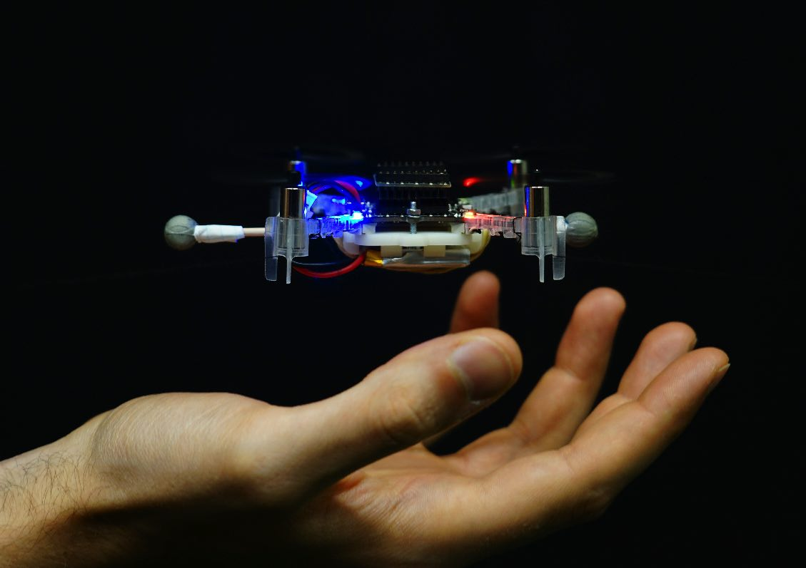

___

### UW–Madison
* Optimal Control (ECE 821): Spring 2024
* Linear Systems (ECE 717): Fall 2024, Fall 2023

___

### ETH Zurich
* [Signals & Systems II](https://people.ee.ethz.ch/~sigsys/) (head teaching assistant)
* [Quad-rotors: Control and Estimation](https://www.dfall.ethz.ch/pands.php)

